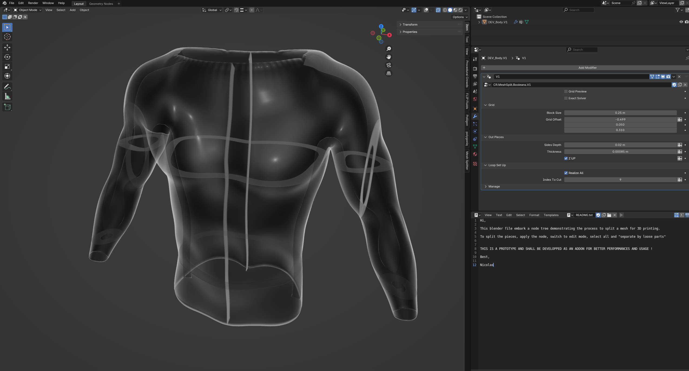
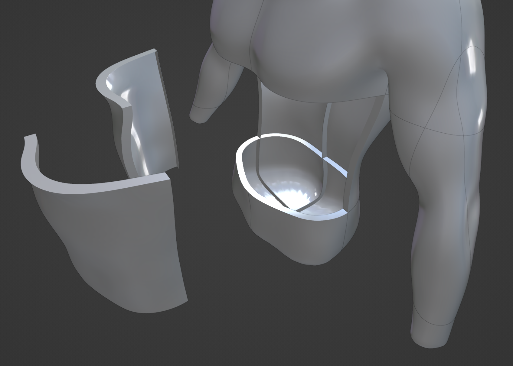
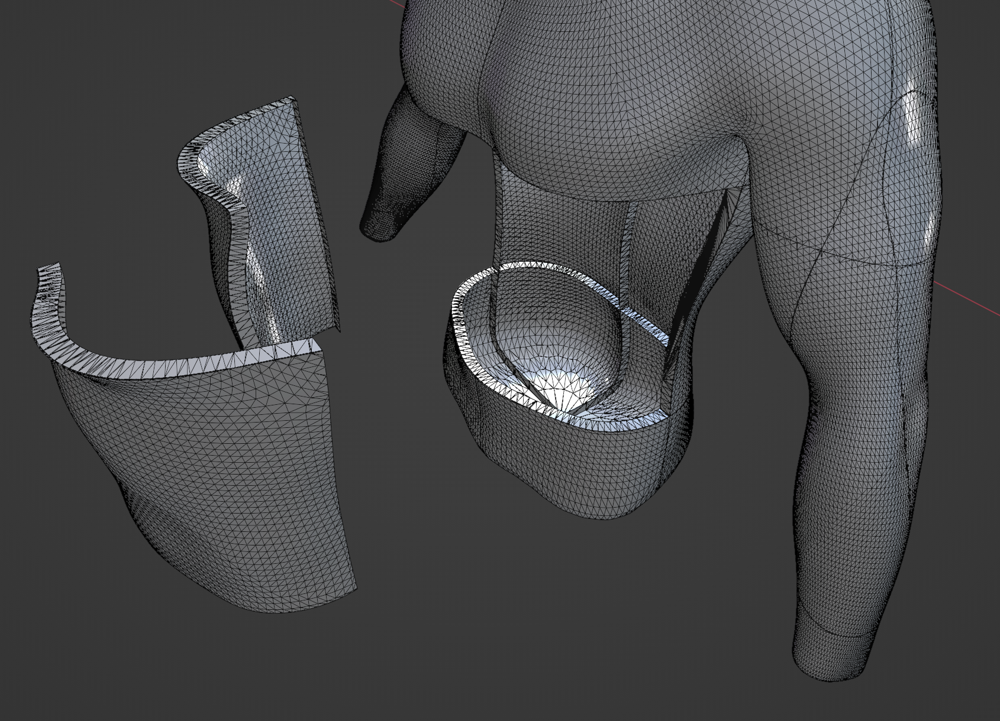
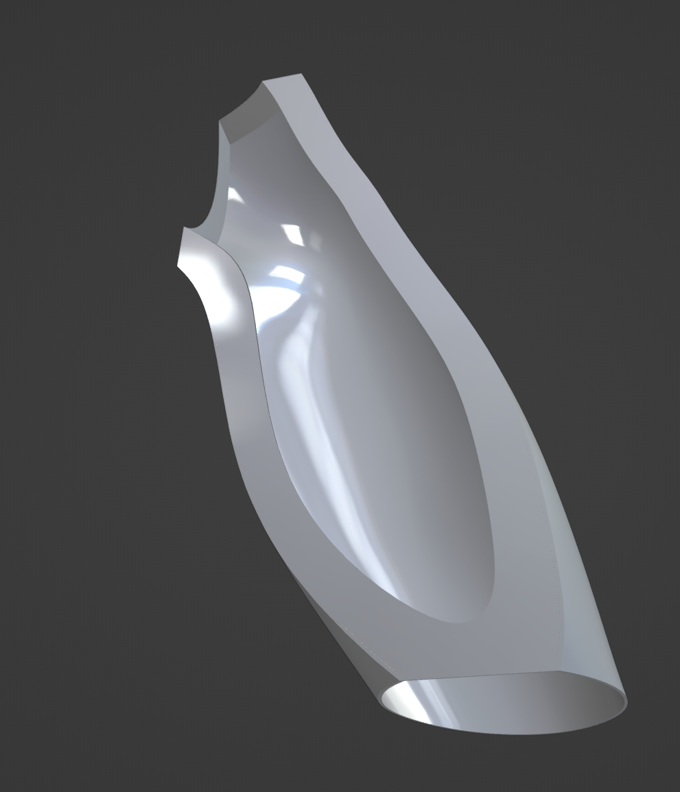
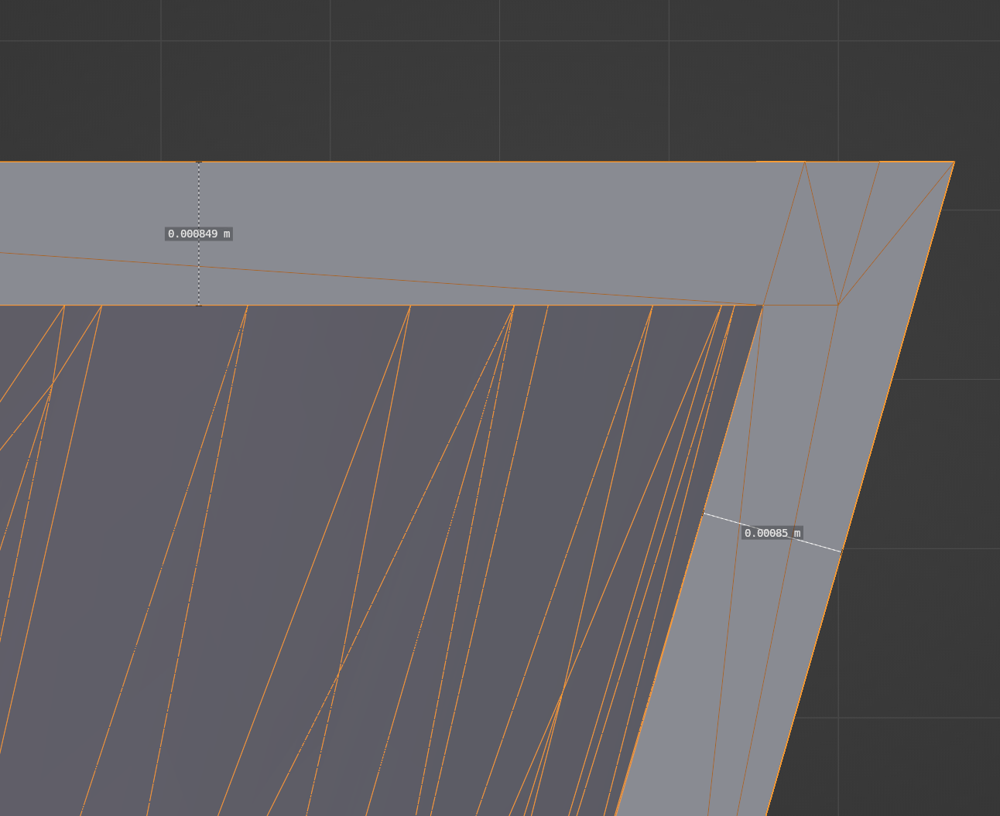
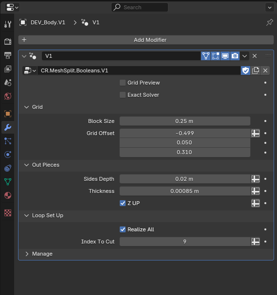
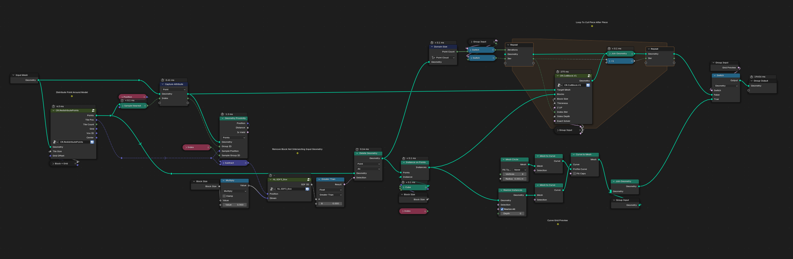

# Mesh Splitter

A Blender add-on to implement few tools to split a mesh in order to be printable part by part

### Geometry Nodes Prototype

Split Mesh Surface              |  Split Mesh Topology
:-------------------------:|:-------------------------:
  |  

Split Arm Piece             |  Piece Thickness
:-------------------------:|:-------------------------:
 |  

Modifier GUI             |  Node Tree
:-------------------------:|:-------------------------:
 | 

### Developpers

The geometry node tree is made to demonstrate the process considered to be implemented into a proper addon

To operate the boolean operations, particularly ressource intensive, some python wrappers + cuda modules (?) would probably be much faster.

### References

- luban : https://www.luban3d.com/
- Inigo Quilez : https://iquilezles.org/articles/